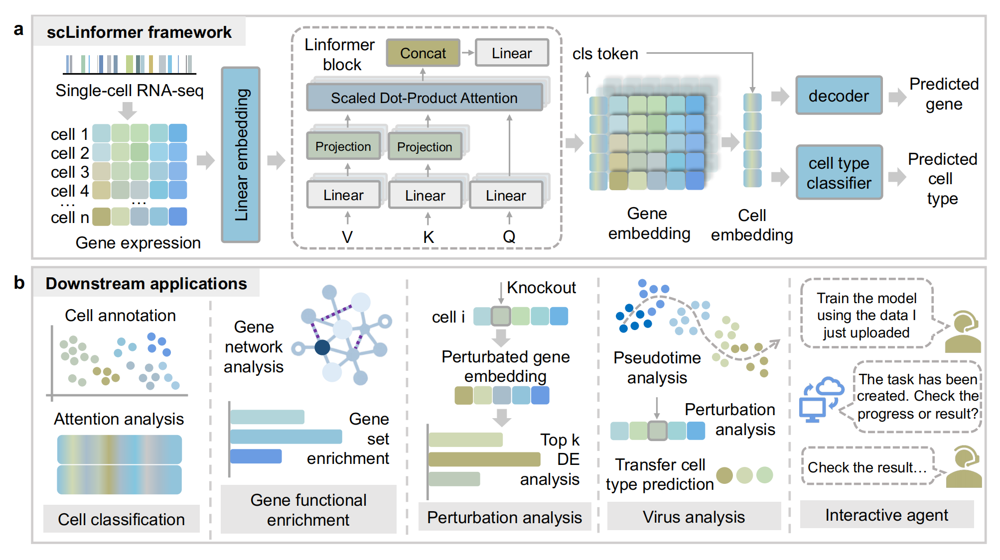

# scLinformer

**scLinformer: an efficient and transferable framework for representation learning of cells and genes for single-cell analysis**



## Installation

**scLinformer**

Only `scLinformer` needs to be installed if you only use the model.

```shell
git clone https://github.com/TRCDHH/scLinformer.git
conda create -n scLinformer python==3.10
conda activate scLinformer
pip install .
```

**Agent (Optional) **

The following components are required **only if you want to run the agent service**.

**MCP**

```sh
conda activate scLinformer
pip install pymysql fastmcp python-dotenv fastapi uvicorn
python agent/mcp-service/mcp-service.py
```

**Web App**

```shell
npm install
npm run dev
```

**Database**

```shell
CREATE DATABASE agent_db;
mysql -u root -p agent_db < sql/init.sql
```

**Service (Java)**

**Configuration (agent/agent-service/src/main/resources/application.yml)**

```yaml
# mysql
spring:
  datasource:
    url: jdbc:mysql://localhost:3306/agent_db?useSSL=false&serverTimezone=UTC
    username: root
    password: your_password
    
# llm    
langchain4j:
  open-ai:
    streaming-chat-model:
      base-url: https://dashscope.aliyuncs.com/compatible-mode/v1
      api-key: ${API-KEY}
      model-name: your_model_name
      log-requests: true
      log-responses: true
  community:
    redis:
      host: xxxx
      port: 6379
      dimension: 384
```

**Run Service**

```shell
mvn clean package
java -jar target/xxx.jar
```

To check the jar name:

```sh
ls target
```

## Quick Start

The model training, evaluation, and metric computation are implemented in train.py.

```
python train.py
```

## Data Available

- Immune https://figshare.com/ndownloader/files/25717328
- Lung atlas https://figshare.com/ndownloader/files/24539942
- BMMC https://www.ncbi.nlm.nih.gov/geo/query/acc.cgi?acc=GSE194122
